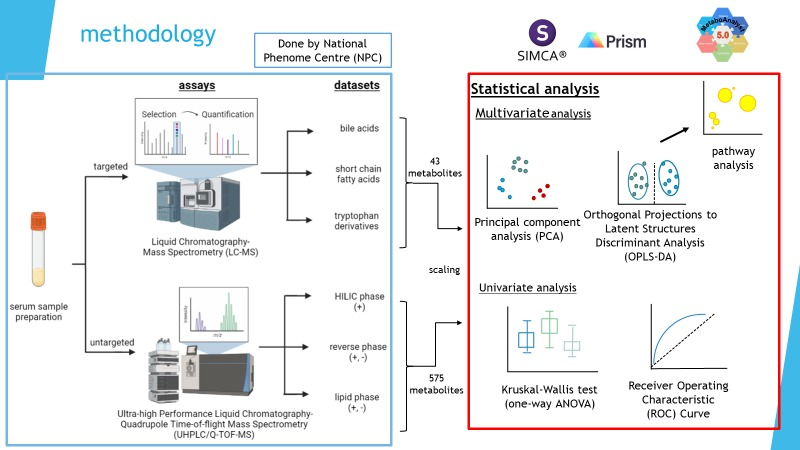

# Exploring metabolite biomarkers for IBD diagnosis 
The scope focuses on finding serum metabolite biomarkers from a cross-sectional study.
Here shows the metabolomic workflow, with serum samples for instance.

### 1. files

**archived**: data backup.

**data**: contains targeted and untargeted metabolomic datasets from 3 biofluid samples (urine, faecal, serum). 

**code**: preprocess data (tidying, scaling) for multivariate and univariate analysis. 

**output**: includes plots and database for metabolite annotation for pathway analysis in metaboanalyst.

### 2. report
